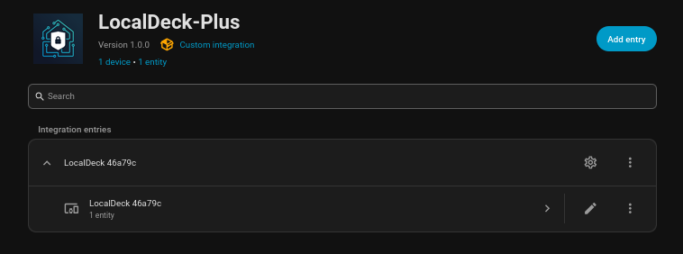
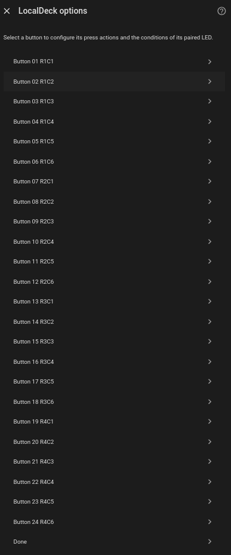
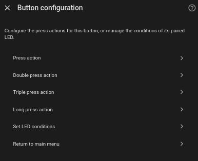
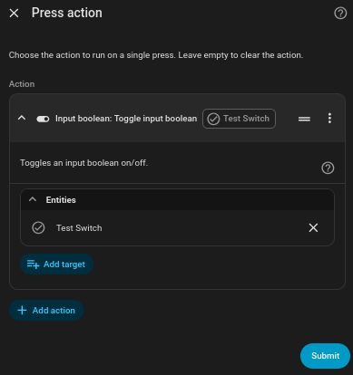
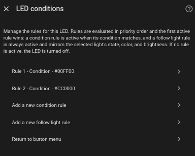
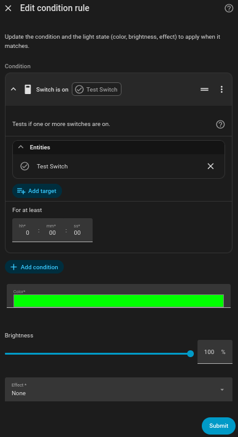

# PRERELEASE WARNING - THIS IS STILL IN ACTIVE DEVELOPMENT AND SHOULD NOT BE USED YET

# LocalDeck-Plus
A Custom Firmware and Integration combination to unlock the potential of your [LocalDeck](https://www.mylocalbytes.com/products/localdeck-set).

## Some example screenshots

## What is this?
This is a replacement firmware for the LocalDeck from LocalBytes that comes with its own custom integration to enable its functionality using native Home Assistant tools.

## Why did I make this
A few things about the stock setup were not to my liking:
- Using an App (Add-on) to rebuild the firmware constantly
- Giving the device execute permissions and having it make action calls directly to Home Assistant
- Button/LED 01 was in the wrong place
- I used a large automation to provide functionality for a while but it was messy
- A rewrite of the firmware could take advantage of advancements in recent ESPHome releases and provide better functionality.

## Firmware features
- Connecting to a WiFi network can be done in multiple ways.
    - Via the ESPHome Web Tools if plugged in.
    - Via captive portal on a broadcast AP.
    - Via "Improv via BLE" so it can be done straight from Home Assistant if you have Bluetooth setup.
- IPv6 Support
- Buttons and LEDs are labelled with both their name and their position in the grid, e.g. "Button 01 R1C1"
- Bluetooth Proxy built in for use with Home Assistant
- Update system integrated for easy updates that can be triggered from Home Assistant without rebuilding/reflashing the device manually.
- Custom action calls exposed to Home Assistant to:
    - Force an update to reinstall the firmware
    - Install the Stock Firmware from LocalBytes

## Integration features
- Finds your LocalDecks from the ESPHome integration
- Makes calls directly through the ESPHome integration so you do not end up with duplicate entities.
- Button Actions and LED Bindings handled by the integration's configuration options.
- Assign actions to buttons.
    - Assigning actions uses the native Home Assistant action selector.
    - 4 different actions (or sets of actions) can easily be assigned to each button mapped to:
        - Single Press
        - Double Press
        - Triple Press
        - Long Press
- Priority-based LED Binding Rules.
    - Condition-based rules use the native Home Assistant Condition selector.
        - If a condition is met then the LED is set to:
            - The Specified Color
            - The Specified Brightness
            - The Specified Effect
        - If a condition is not met then it proceeds to the next rule.
    - Follow Light Rule.
        - Select any light entity to follow.
        - The LED will mirror the selected lights:
            - On/Off Status
            - Color
            - Brightness
    - Rules can be moved up and down in priority
    - Rules can be deleted or disabled
    - Rules can be mixed so you can have a state based on a condition, and if that condition fails, it proceeds to following a light.
    - Invalid/Incomplete condition rules should be skipped whilst producing an error in the core log.
- Disable LEDs Switch to darken your LocalDeck, which, when switched off, allows them to go right back to following their rules. NB: You can still manually turn lights on when this is on via the ESPHome integration.

## What are the advantages of this setup over the stock firmware?

- No need to have the "configurator" App (Add-on).
- No need to have the ESPHome Builder Tool App installed.
- It is easier to run on Home Assistant container installs without App support.
- No need to give the device permission to execute action calls on Home Assistant.
- No need to rebuild the firmware every time you want to change an option.
- Button 01 is now in the top left.

## Preparing to move from old setup to this
It is recommended that, before you start, do the following:
- Remove the device from the ESPHome Integration
- Remove the device from the ESPHome Builder Tool.
- Disable any automations that interact directly with the device

## Installation instructions
### Firmware
- Download the latest `localdeck-plus.factory.bin` file from the releases section of this repo.
- Plug the LocalDeck into your PC via USB.
- Use the [ESPHome Web Tool](https://web.esphome.io/) to flash the firmware onto the device.
- Optional: Use the Web Tool to add your WiFi credentials.
- Connect to your WiFi network using Web Tools / WiFi Captive Portal / BLE.

### Integration
#### Option A - Add this repo to HACS as a custom repository
- On the HACS page open the overflow menu in the top right
- Select "Custom repositories"
- Add this repo by its URL `https://github.com/MichaelMKKelly/LocalDeck-Plus`
- Install via the HACS UI
- Restart Home Assistant

#### Option B - Manual Install
- Download the latest version of the integration either from the releases section or by cloning this repo
- Extract the .zip file (if gotten from releases section)
- Place the localdeckplus directory into the `custom_components` directory of your Home Assistant setup
- Restart Home Assistant

## Setup instructions
### Hardware
Ensure that you have connected your LocalDeck to your WiFi network by either:
- [ESPHome Web Tool](https://web.esphome.io/) (Must be plugged into the PC for this)
- Connect to the device's broadcast AP and use the captive portal at `http://192.168.4.1`
- Improv via BLE - If you have Bluetooth set up on your Home Assistant then it should pop up straight away or you can use the Home Assistant App on a mobile device.

### Integration
#### ESPHome Integration
Add the device to the ESPHome integration. This will usually pop right up as a detected device but you may need to find the IP address and add it manually if it does not.
#### LocalDeck-Plus Integration
- Ensure that the device is flashed to the correct firmware and is already added to the ESPHome integration.
- Go to your Home Assistant `Devices & services` page
- Click "Add Integration"
- Select "LocalDeck-Plus"
- Select your LocalDeck device from the list.

### Integration Configuration
- Go to your Home Assistant `Devices & services` page
- Select LocalDeck-Plus
- Click the "cog" icon next to your device to open the menu
- Select the button you want to add/edit.
- Actions
    - Select the press type you want to add/edit
    - Use the selector to add your action or actions
    - Click Submit
- LED conditions
    - Select "Set LED conditions"
    - Add the type of rule you want
        - Condition rule
            - Use the selector to select a condition.
            - Select a color using the color selector
            - Optional: Change Brightness (Default: 100%)
            - Optional: Select an effect (Default: None)
            - Click Submit
        - Follow light rule
            - Use the light entity selector to pick a light to follow
            - Click Submit

## FAQs

#### Do I need any Apps (Add-ons) to run this setup
No
#### Can I migrate my existing LocalDeck config to the new setup?
No
#### Can I use the integration with the stock firmware?
No

## Disclaimer
I am not an employee of LocalBytes.
Be careful because:
- You are installing third-party firmware on your device.
- You are running a third-party integration on your Home Assistant setup.
I make no promises about ongoing support.

## AI/LLM acknowledgement
I used a locally running Qwen3.8:27B during this project. I have fully tested all code produced by the model.

## Credits
- [LocalBytes](https://www.mylocalbytes.com/) - For making/selling the [LocalDeck](https://www.mylocalbytes.com/products/localdeck-set)
- The [Home Assistant](https://www.home-assistant.io/) team - For making Home Assistant
- The [ESPHome](https://esphome.io/) team - For making ESPHome
- The [Open Home Foundation](https://www.openhomefoundation.org/) - For supporting the Home Assistant and ESPHome projects.